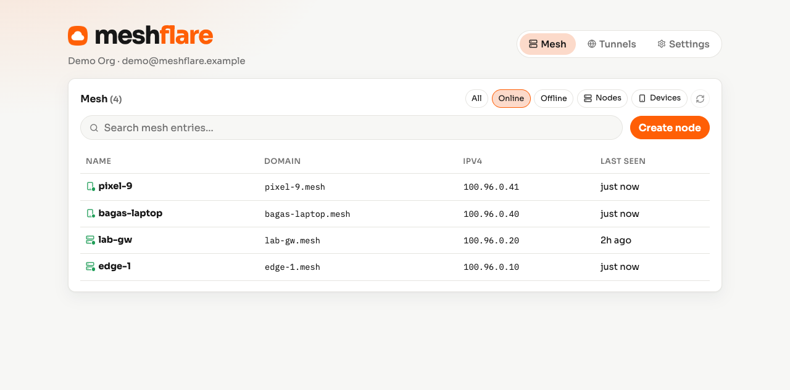
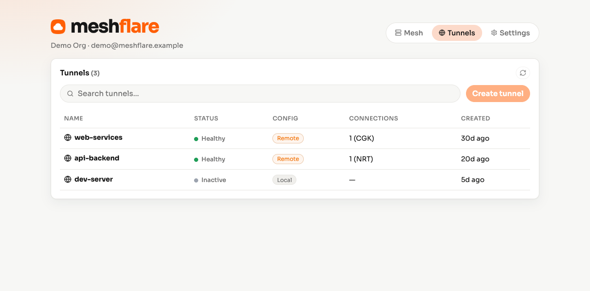
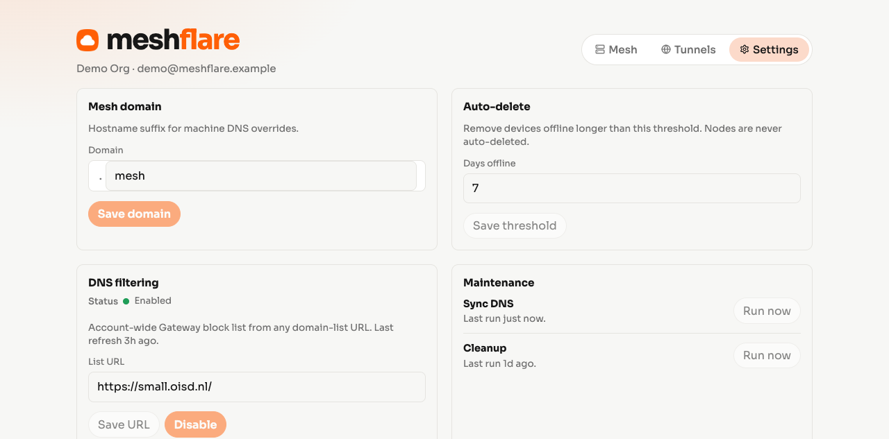

# meshflare

Self-hostable [Cloudflare](https://www.cloudflare.com/) Mesh & Tunnel manager. One Docker image — UI, API, cron, and WireGuard extract.

**Demo (read-only):** [https://meshflare.wastu.workers.dev](https://meshflare.wastu.workers.dev)

<p align="center">
  <picture>
    <source media="(prefers-color-scheme: dark)" srcset="docs/screenshots/demo-mesh-dark.png">
    
  </picture>
</p>

<p align="center">
  <picture>
    <source media="(prefers-color-scheme: dark)" srcset="docs/screenshots/demo-tunnels-dark.png">
    
  </picture>
</p>

<p align="center">
  <picture>
    <source media="(prefers-color-scheme: dark)" srcset="docs/screenshots/demo-settings-dark.png">
    
  </picture>
</p>

## Features

- Cloudflare Mesh (formerly WARP-to-WARP) management
- Cloudflare Tunnel management (list, create, rename, delete; ingress rules CRUD)
- Auto-assign all mesh nodes and devices with `.mesh` domain (configurable)
- WireGuard `.conf` download for nodes
- Private CIDR and hostname routes for Mesh nodes
- Default WARP profile split-tunnel management (include/exclude, CIDRs, and hostnames)
- DNS filtering from any domain-list URL (default [small.oisd.nl](https://small.oisd.nl/))
- Auto-delete device on mesh network if offline longer than N days (default 7)

## Image

`ghcr.io/bgwastu/meshflare`

## Config

| Name | Notes |
|------|--------|
| `CLOUDFLARE_ACCOUNT_ID` | required (unless `DEMO_MODE`) |
| `CLOUDFLARE_API_TOKEN` | preferred |
| `CLOUDFLARE_API_KEY` + `CLOUDFLARE_EMAIL` | alt |
| `DATA_DIR` | default `/data` (lowdb + filter cache) |
| `PORT` | default `3000` |
| `DEMO_MODE` | `true` / `1` — fixture data, all writes return 403 |

### Cloudflare API permissions

Use an account-scoped API token whenever possible. Meshflare needs these Cloudflare account permissions:

| Permission | Used for |
|------------|----------|
| `Zero Trust Read` | Read Mesh nodes, WARP registrations, Gateway rules, device policies, and DNS locations |
| `Zero Trust Write` | Create, rename, delete, and route Mesh nodes; manage Gateway DNS rules and device policies |
| `Cloudflare Zero Trust Secure DNS Locations Write` | Enable IPv4/IPv6/DoH endpoints and update DNS location source networks from Settings |

`Zero Trust Write` may already include the read capabilities in your token template. If Cloudflare presents separate read/write choices, grant both. The Secure DNS Locations permission is required even when the token can otherwise manage Zero Trust resources.

The alternative `CLOUDFLARE_API_KEY` + `CLOUDFLARE_EMAIL` uses a Global API Key and has broad account access; use it only when an API token is not available. Never commit either credential or place it in a public image.

WireGuard configs use your account's DNS endpoints, so Gateway policies can apply, and Meshflare reuses registration keys and device IPs.

```bash
cp .env.example .env
bun install
bun run build
bun run dev        # API on :3000
bun run dev:client # Vite UI (proxies /api)
```

Keep the `/data` volume when upgrading or replacing the container. Meshflare
stores each node's WireGuard registration there so regenerating a config reuses
the same key and device IP instead of enrolling a new device.

## Docker

```bash
docker run --rm -p 3000:3000 \
  -v meshflare-data:/data \
  -e CLOUDFLARE_ACCOUNT_ID=… \
  -e CLOUDFLARE_API_TOKEN=… \
  ghcr.io/bgwastu/meshflare:latest
```
