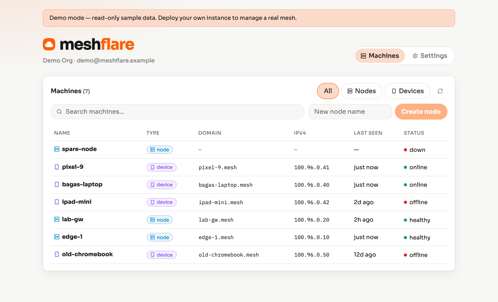

# meshflare

Self-hostable [Cloudflare](https://www.cloudflare.com/) Mesh manager (Bun + Hono). One Docker image — UI, API, cron, and WireGuard extract.

**Demo (read-only):** [https://meshflare.workers.dev](https://meshflare.workers.dev)

<p align="center">
  <picture>
    <source media="(prefers-color-scheme: dark)" srcset="docs/screenshots/demo-machines-dark.png">
    
  </picture>
</p>

## Features

- Machines inventory (nodes + devices)
- WireGuard `.conf` download for nodes
- Configurable mesh domain (default `.mesh`) and Gateway DNS sync when an IP is known
- Auto-delete devices offline longer than N days (default 7; nodes excluded)
- Configurable DNS filtering from any domain-list URL (default [small.oisd.nl](https://small.oisd.nl/))
- `DEMO_MODE` for a read-only fixture UI (no Cloudflare credentials required)

## Image

`ghcr.io/bgwastu/meshflare`

## Config

| Name | Notes |
|------|--------|
| `CLOUDFLARE_ACCOUNT_ID` | required (unless `DEMO_MODE`) |
| `CLOUDFLARE_API_TOKEN` | preferred |
| `CLOUDFLARE_API_KEY` + `CLOUDFLARE_EMAIL` | alt |
| `DATA_DIR` | default `/data` (lowdb + filter cache) |
| `PORT` | default `3000` |
| `DEMO_MODE` | `true` / `1` — fixture data, all writes return 403 |

```bash
cp .env.example .env
bun install
bun run build
bun run dev        # API on :3000
bun run dev:client # Vite UI (proxies /api)
bun run dev:demo   # local read-only demo
```

## Docker

```bash
docker run --rm -p 3000:3000 \
  -v meshflare-data:/data \
  -e CLOUDFLARE_ACCOUNT_ID=… \
  -e CLOUDFLARE_API_TOKEN=… \
  ghcr.io/bgwastu/meshflare:latest
```

WireGuard download needs a WireGuard device profile. CI pushes GHCR and triggers deploy via `WEBHOOK_URL` + `WEBHOOK_TOKEN`.

## Public demo (Cloudflare Workers)

The read-only demo is a Workers + static assets deploy (`wrangler.demo.jsonc`):

```bash
bun run deploy:demo
```

Requires `CLOUDFLARE_API_TOKEN` / account access for Wrangler. Default workers.dev host: `https://meshflare.workers.dev`.
